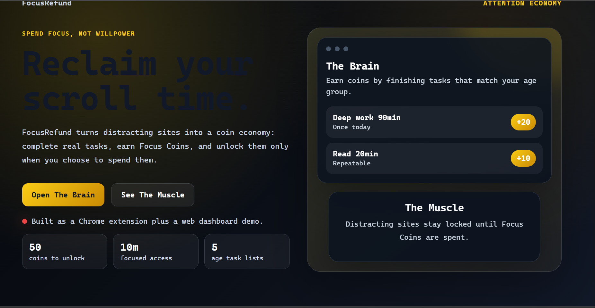
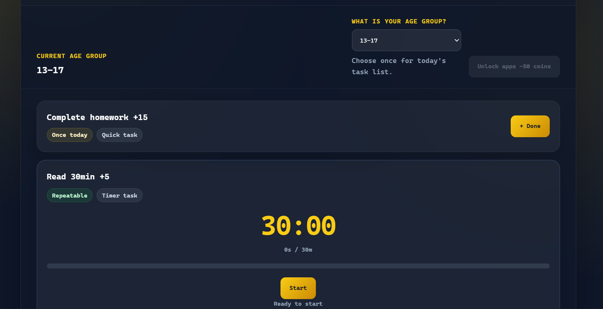
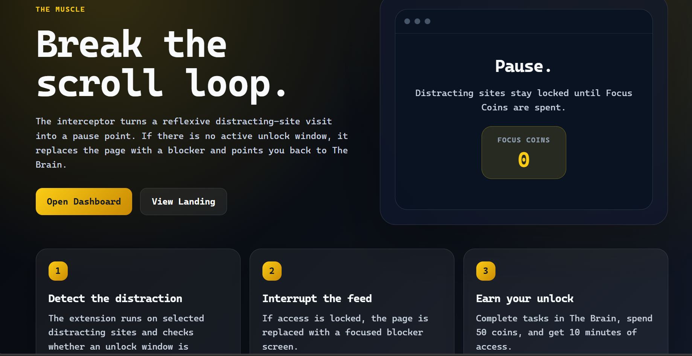

# FocusRefund

FocusRefund is a productivity experiment that turns distracting site access into a coin economy. Users earn Focus Coins by completing real-world focus tasks, then spend coins to unlock selected distracting sites for a short window.

**Live demo**: https://focus-refund.pages.dev

## Tech Stack

- HTML
- CSS
- JavaScript
- Chrome Extension APIs
- LocalStorage / Chrome sync storage

## How It Works

1. Choose an age group to get a task list.
2. Complete focus tasks to earn Focus Coins.
3. Spend 50 coins to unlock selected distracting sites for 10 minutes.
4. The Chrome extension blocks those sites again after the unlock time expires.

## Features

- Responsive landing page and dashboard
- Chrome extension popup
- Multi-site distraction blocker content script
- Daily age-group locking to reduce task switching
- Timer-based and quick-complete tasks
- Repeatable and once-per-day task types
- Focus Coin balance stored locally
- Close-tab blocker action through a background service worker

## Project Structure

```text
index.html                       Landing page
extension/popup.html             Chrome extension popup
extension/dashboard/index.html   Focus task dashboard
extension/content.js             Multi-site distraction blocker
extension/background.js          Extension background worker
interceptor/stopscroll.html      Demo explainer page
```

## Screenshots

### Landing Page



### Dashboard - The Brain



### Chrome Extension Popup


### Interceptor - The Muscle


